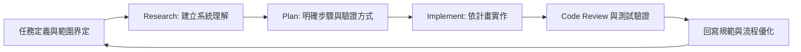

## 前言
本文根據以下兩份影片字幕整理而成，目標是將分散的演講內容整合為一套可實作、可協作、可持續優化的工程方法。

- 影片一：[No Vibes Allowed: Solving Hard Problems in Complex Codebases – Dex Horthy, HumanLayer](https://www.youtube.com/watch?v=rmvDxxNubIg)
- 影片二：[Everything We Got Wrong About Research-Plan-Implement - Dexter Horthy](https://youtu.be/YwZR6tc7qYg)

兩場演講的共同主軸是：AI coding agent 已經能大幅提升產碼速度，但若缺少流程治理，最終會把速度優勢轉成品質與維運負債。

## 問題背景：為什麼「寫更快」常變成「修更多」
在真實團隊中，AI 對開發效率的影響常出現兩面性：

1. 綠地專案（greenfield）通常能快速產生成果。
2. 既有大型系統（brownfield）容易出現理解偏差與重工。
3. 產碼量上升，但 code review、回歸修正、驗證成本同步上升。

核心矛盾不在於模型「會不會寫」，而在於團隊是否有能力把 AI 產出的程式碼納入可控的工程流程。

## 方法演進：RPI 是骨架，情境工程才是關鍵
演講提出的基本框架是 `Research -> Plan -> Implement (RPI)`，但更深層的重點是 context engineering（情境工程）：用流程與資訊壓縮，讓模型在可控範圍內穩定執行。

### Research：先確保方向正確
研究階段的目標不是立刻改程式，而是回答三件事：

1. 相關程式碼在哪裡。
2. 既有行為如何運作。
3. 這次修改的邊界與風險在哪裡。

如果研究階段方向錯誤，後續計畫與實作會整串偏掉，最後即使「有產出」，也是高成本錯誤產出。

### Plan：把意圖壓縮成可執行步驟
規劃階段的價值在於提升可預測性，而不是製造長文件。高品質計畫應至少包含：

1. 具體修改步驟。
2. 目標檔案或模組範圍。
3. 每個步驟對應的驗證方式。

這會直接降低實作期的漂移，也讓 reviewer 能更快理解「為何這樣改」。

### Implement：執行與驗證同時進行
實作不是機械地讓 agent 一路跑完，而是持續做兩件事：

1. 控制上下文複雜度，避免對話過長導致品質衰退。
2. 針對關鍵改動立即驗證，避免錯誤累積到最後才爆發。

## 關鍵修正：從「看計畫就好」到「一定要讀程式碼」
兩場內容最有價值的地方，是對實務策略的更新：

1. 只看計畫、不讀 code 的做法，在複雜專案中不可持續。
2. 計畫與實際程式碼之間仍有落差，最終品質必須在 code review 把關。
3. 真正的槓桿不是少看程式碼，而是把人力放在高價值判斷點。

可接受的現實是：
即使仍需讀 code，團隊依然可能取得 2 到 3 倍效率提升，而且這比高速產出後再大規模返工更有商業價值。

## 團隊落地：把個人效率轉成組織效率
演講特別強調，AI 時代最大的瓶頸不是「個人產碼」，而是「團隊對齊與治理」。

建議的團隊實作方式：

1. 在 PR 中保留關鍵脈絡：做了什麼、為何這樣做、如何驗證。
2. 將設計討論前置，提早在短文件對齊技術方向。
3. 視任務複雜度調整流程強度，不把同一流程套用到所有任務。
4. 讓資深工程師主導流程設計，而非只在後段清理品質問題。

這會把「AI 產碼速度」轉化為「可擴展的交付能力」，而不是技術債工廠。

## 可執行清單（工程團隊版）
以下清單可直接作為日常開發準則：

1. 任務啟動先做範圍界定，再交給 agent。
2. 中大型任務先研究再規劃，不直接 one-shot 產碼。
3. 計畫必須包含驗證策略，沒有驗證就不算完成。
4. 實作完成後以程式碼為準，不以計畫文字為準。
5. PR 必須能讓 reviewer 重建決策脈絡。
6. 每次失敗案例都要回寫成可重用規範。
7. 技術主管需親自建立並維護 AI 開發流程，不能完全下放。

## 結語
這兩場演講共同指出一件事：

AI coding agent 已經足夠強，但工程成果的上限仍由團隊流程決定。

若只追求「更快產碼」，你會得到更快累積的重工與技術債；
若把人類判斷放在高槓桿節點，並用情境工程與驗證流程包住 AI，才會得到可持續的速度、品質與交付信任。
